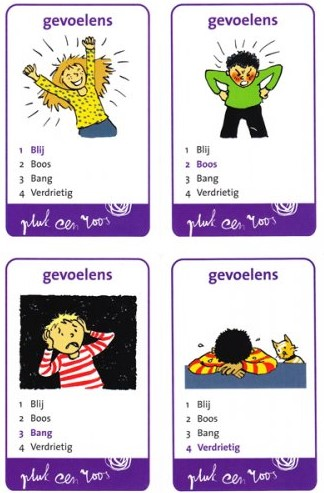

## The Rules
Quartets is a card game which can be played by two or more people, where the objective is to collect the most sets of four cards. These sets can be of any theme: animals, colours, people, etc. All cards show the names of the other three cards that belong to the set as well:

<!--  -->

*Figure 1: An example of a full quartet set*

The number of sets usually depends on the company that publishes the set. The game starts by giving each player 7 cards. The rest of the cards are made into the draw pile. Rules around who can start depend per household, sometimes the youngest player can start, sometimes the player left of the dealer. Each round is the same, which will be explained in the example below:

For our example we have three players: Alice, Bob, and Charlie.
It's Alice's turn, and she asks another player, in this case Bob, for a card by saying out loud: "Bob, do you have the card 'Blij' of the set 'Gevoelens'?" (See Figure 1). All players hear this statement. Alice is only allowed to ask Bob for a card from a certain set if she is in possession of at least one of the other cards of this set. Now two scenarios can happen:

1. Bob is in possession of the 'Blij' card, and has to give it to Alice. Alice can now ask another question to either Bob or another player (Charlie).
2. Bob does not have the 'Blij' card. Now Alice has to draw a card from the draw pile and Bob (the person Alice asked the question to) can now start his turn.

When a player has completed a set, they place this set on the table in front of them. This indicates to all players which sets have been completed and how many completed sets each player has. When all sets of cards have been placed on the table, i.e. when no player holds any cards in their hands anymore and the draw pile is empty, the game is finished. The player with the most complete sets wins the game.

A key difference between this game and the game 'Go Fish' is that, in this game, the player requests a specific card from a set, whereas in Go Fish, the player requests any and all cards from a specific set. This also has consequences for what knowledge can be deduced from the questions and answers. Players are allowed to ask others for cards they already have, in an effort to confuse others or to avoid others having knowledge about them.

## Quartets & LAMAS
Quartets seems like an easy game, however, if you look at the logic behind all of it, it becomes clear there is quite some involved. 

First of all, because everyone asks others about cards in a shared space, all announcements are made publicly. In the example before where Alice asked Bob about the 'Blij' card, Alice, Bob and any other players heard Alice ask this. 

Higher-order knowledge comes into play when players start to think about what cards other players have in possession. Both Bob and Charlie know that, because Alice asked for a card in the 'Gevoelens' set, she must have at least one card of that set in her hand. Alice also knows that Bob and Charlie know that she has a card in that set, and both Bob and Charlie know that Alice knows that they know that she has a card of the 'Gevoelens' set, etc.
It is therefore also common knowledge that the player who asked for a specific card is in possession of a card from that set. 

For now, our research question will be if there is a downside to asking for a card you want to receive. This could be because others now know you already have at least one card of that set. 